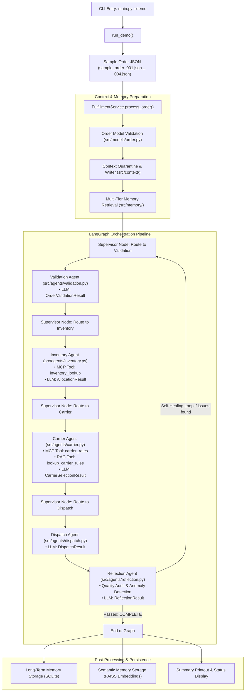

# End-to-End Application Flow Documentation (`--demo`)

This document provides a comprehensive step-by-step breakdown of what happens when running:
```bash
python main.py --demo
```
It details every module, function call, agent execution, tool call, memory operation, and state transition across the fulfillment pipeline.

---

## 1. High-Level Flowchart



---

## 2. Chronological Execution Trace

### Phase 1: CLI Entry & Ingestion
- **File**: [`main.py`](file:///c:/Users/ray09/Music/airdawg-document/capstone2/main.py)
- **Function**: `main()` → `run_demo()`
- **Process**:
  1. The CLI detects the `--demo` flag.
  2. `run_demo()` loops through the four sample order files located in `data/orders/`:
     - `sample_order_001.json`: Standard retail order (Laptop + Mouse, non-hazmat)
     - `sample_order_002.json`: Express priority order
     - `sample_order_003.json`: Hazmat order (chemical/battery materials requiring hazmat carrier)
     - `sample_order_004.json`: Edge-case / high-quantity order (tests multi-warehouse split)
  3. For each file, `process_order_file(fpath, thread_id="demo-thread-i")` is invoked.

---

### Phase 2: Service Setup & Context Engineering
- **File**: [`src/application/service.py`](file:///c:/Users/ray09/Music/airdawg-document/capstone2/src/application/service.py)
- **Class / Method**: `FulfillmentService.process_order()`

1. **Pydantic Validation**:
   - Parses order dictionary with `Order(**order_dict)` defined in [`src/models/order.py`](file:///c:/Users/ray09/Music/airdawg-document/capstone2/src/models/order.py).
   - Calculates dynamic properties: `total_weight`, `total_items`, and SKU list.

2. **Context Quarantine**:
   - Invokes `ContextManager.prepare_order_context()` in [`src/context/manager.py`](file:///c:/Users/ray09/Music/airdawg-document/capstone2/src/context/manager.py).
   - Calls `ContextQuarantine.quarantine_order_text()` in [`src/context/quarantine.py`](file:///c:/Users/ray09/Music/airdawg-document/capstone2/src/context/quarantine.py).
   - Scans untrusted user fields (e.g. `special_instructions`) for prompt injection patterns and encapsulates them in isolated `<quarantined_user_input>` XML tags.

3. **Memory Context Injection**:
   - Queries `MemoryManager.get_context_for_agent(order_id)` in [`src/memory/manager.py`](file:///c:/Users/ray09/Music/airdawg-document/capstone2/src/memory/manager.py).
   - Pulls context from:
     - **Working Memory**: In-memory volatile cache.
     - **Short-Term Memory**: SQLite store for recent session transactions.
     - **Long-Term Memory**: Persistent historical orders.
     - **Semantic Memory**: FAISS vector search for past carrier and allocation choices.

4. **Initial Graph State**:
   - Initializes `FulfillmentState` with status `PENDING`, retry count `0`, and quarantined context.

---

### Phase 3: LangGraph State Machine Execution

The graph execution is managed by `self.graph.stream(initial_state, config={"configurable": {"thread_id": thread_id}})` defined in [`src/graph/builder.py`](file:///c:/Users/ray09/Music/airdawg-document/capstone2/src/graph/builder.py).

```
START ──> supervisor ──> validation ──> supervisor ──> inventory ──> supervisor ──> carrier ──> supervisor ──> dispatch ──> reflection ──> COMPLETE
```

#### Step 1: Supervisor Node (Initial Routing)
- **Node**: `supervisor` in [`src/graph/nodes.py`](file:///c:/Users/ray09/Music/airdawg-document/capstone2/src/graph/nodes.py#L27)
- **Agent**: `SupervisorAgent` in [`src/agents/supervisor.py`](file:///c:/Users/ray09/Music/airdawg-document/capstone2/src/agents/supervisor.py#L30)
- **Logic**: Inspects `state["status"]` (`PENDING`).
- **Routing**: `_STATUS_TO_ACTION` maps `PENDING` → `RoutingDecision.VALIDATE`.
- **Router**: `supervisor_router` in [`src/graph/routing.py`](file:///c:/Users/ray09/Music/airdawg-document/capstone2/src/graph/routing.py#L15) routes to node `validation`.

---

#### Step 2: Validation Node
- **Node**: `validation` in [`src/graph/nodes.py`](file:///c:/Users/ray09/Music/airdawg-document/capstone2/src/graph/nodes.py#L41)
- **Agent**: `ValidationAgent` in [`src/agents/validation.py`](file:///c:/Users/ray09/Music/airdawg-document/capstone2/src/agents/validation.py#L12)
- **Context Filtering**: `ContextSelector.select_for_agent()` selects `order_summary`, `shipping`, and `items`.
- **LLM Call**: Invokes Gemini (`ChatGoogleGenerativeAI`) via `_invoke_structured()`.
  - **Schema**: `OrderValidationResult` in [`src/models/order.py`](file:///c:/Users/ray09/Music/airdawg-document/capstone2/src/models/order.py)
  - **Checks**: Non-empty customer/address, valid quantities (≥1), positive prices, delivery date feasibility, hazmat SKU detection, total price calculation.
- **State Update**: Updates state with `validation_result` and sets status `VALIDATING` (or `VALIDATION_FAILED`).
- **Router**: `validation_router` routes back to `supervisor`.

---

#### Step 3: Supervisor Node (Post-Validation)
- **Logic**: `VALIDATING` maps to `RoutingDecision.ALLOCATE_INVENTORY`.
- **Router**: `supervisor_router` routes to node `inventory`.

---

#### Step 4: Inventory Node
- **Node**: `inventory` in [`src/graph/nodes.py`](file:///c:/Users/ray09/Music/airdawg-document/capstone2/src/graph/nodes.py#L62)
- **Agent**: `InventoryAgent` in [`src/agents/inventory.py`](file:///c:/Users/ray09/Music/airdawg-document/capstone2/src/agents/inventory.py#L14)
- **Tool Invocations**:
  - Calls MCP tool `inventory_lookup` via `self.inv_tool.invoke({"skus": skus})` in [`src/mcp/client.py`](file:///c:/Users/ray09/Music/airdawg-document/capstone2/src/mcp/client.py) to fetch live warehouse stock levels.
- **LLM Call**: Invokes Gemini with order items, shipping destination, and real-time warehouse inventory data.
  - **Schema**: `AllocationResult` in [`src/models/inventory.py`](file:///c:/Users/ray09/Music/airdawg-document/capstone2/src/models/inventory.py)
  - **Logic**: Chooses the geographically closest warehouse; splits fulfillment across warehouses if stock is dispersed; flags backordered if insufficient.
- **State Update**: Updates state with `allocation_result` and sets status `ALLOCATING_INVENTORY` (or `SPLIT_FULFILLMENT`).
- **Router**: `inventory_router` routes back to `supervisor`.

---

#### Step 5: Supervisor Node (Post-Inventory)
- **Logic**: `ALLOCATING_INVENTORY` or `SPLIT_FULFILLMENT` maps to `RoutingDecision.SELECT_CARRIER`.
- **Router**: `supervisor_router` routes to node `carrier`.

---

#### Step 6: Carrier Selection Node
- **Node**: `carrier` in [`src/graph/nodes.py`](file:///c:/Users/ray09/Music/airdawg-document/capstone2/src/graph/nodes.py#L83)
- **Agent**: `CarrierAgent` in [`src/agents/carrier.py`](file:///c:/Users/ray09/Music/airdawg-document/capstone2/src/agents/carrier.py#L15)
- **Tool Invocations**:
  1. **MCP Tool**: `carrier_rates` via `self.carrier_tool.invoke(...)` in [`src/mcp/client.py`](file:///c:/Users/ray09/Music/airdawg-document/capstone2/src/mcp/client.py). Calculates live rates based on weight, destination state, service level, and hazmat flags.
  2. **RAG Tool**: `lookup_carrier_rules` in [`src/rag/rag_tool.py`](file:///c:/Users/ray09/Music/airdawg-document/capstone2/src/rag/rag_tool.py). Performs similarity retrieval using FAISS index (`src/rag/vector_store.py`) against carrier regulatory documentation (`data/rag/carrier_rules.md`).
- **LLM Call**: Invokes Gemini with order weight, carrier rate quotes, and regulatory rules.
  - **Schema**: `CarrierSelectionResult` in [`src/models/carrier.py`](file:///c:/Users/ray09/Music/airdawg-document/capstone2/src/models/carrier.py)
  - **Logic**: Filters for hazmat certification (rule CR-001), service level matching (CR-004), reliability threshold ≥ 0.90 for express (CR-007), and cost minimization (CR-005).
- **State Update**: Updates state with `carrier_result` and sets status `SELECTING_CARRIER`.
- **Router**: `carrier_router` routes back to `supervisor`.

---

#### Step 7: Supervisor Node (Post-Carrier)
- **Logic**: `SELECTING_CARRIER` maps to `RoutingDecision.DISPATCH`.
- **Router**: `supervisor_router` routes to node `dispatch`.

---

#### Step 8: Dispatch Node
- **Node**: `dispatch` in [`src/graph/nodes.py`](file:///c:/Users/ray09/Music/airdawg-document/capstone2/src/graph/nodes.py#L104)
- **Agent**: `DispatchAgent` in [`src/agents/dispatch.py`](file:///c:/Users/ray09/Music/airdawg-document/capstone2/src/agents/dispatch.py#L12)
- **LLM Call**: Invokes Gemini with warehouses used and carrier details.
  - **Schema**: `DispatchResult` in [`src/models/fulfillment.py`](file:///c:/Users/ray09/Music/airdawg-document/capstone2/src/models/fulfillment.py)
  - **Logic**: Formats `dispatch_id` (`DSP-YYYY-XXXXXX`), generates tracking numbers (`TRK-...`), and computes estimated delivery dates and total costs.
- **State Update**: Updates state with `dispatch_result` and sets status `DISPATCHED`.
- **Router**: `dispatch_router` routes directly to `reflection`.

---

#### Step 9: Reflection & Self-Healing Node
- **Node**: `reflection` in [`src/graph/nodes.py`](file:///c:/Users/ray09/Music/airdawg-document/capstone2/src/graph/nodes.py#L125)
- **Agent**: `ReflectionAgent` in [`src/agents/reflection.py`](file:///c:/Users/ray09/Music/airdawg-document/capstone2/src/agents/reflection.py#L11)
- **LLM Call**: Invokes Gemini with the entire cumulative fulfillment context.
  - **Schema**: `ReflectionResult` in [`src/models/agent.py`](file:///c:/Users/ray09/Music/airdawg-document/capstone2/src/models/agent.py)
  - **Logic**: Audits the pipeline against a 6-point checklist (validation integrity, stock allocation success, carrier compliance, hazmat certification compliance, dispatch confirmation, shipping cost sanity).
- **Self-Healing Routing (`reflection_router`)**:
  - If `needs_reprocessing = False`: Maps to `COMPLETE` → execution terminates at LangGraph `END`.
  - If `needs_reprocessing = True`: Routes back to the requested stage (`validation`, `inventory`, `carrier`, or `dispatch`) for corrective self-healing.

---

### Phase 4: Post-Processing & Persistence
- **File**: [`src/application/service.py`](file:///c:/Users/ray09/Music/airdawg-document/capstone2/src/application/service.py#L86-L125)
- **Method**: `_store_results_in_memory()`

1. **Long-Term Memory**:
   - Saves final status and elapsed execution time to SQLite database at `runtime/memory/memory.db`.
2. **Semantic Memory**:
   - Vectorizes carrier selection decision and reasoning using `BAAI/bge-small-en-v1.5` embeddings and stores in FAISS semantic index for contextual recall in future orders.

---

### Phase 5: Terminal Output & Reporting
- **File**: [`main.py`](file:///c:/Users/ray09/Music/airdawg-document/capstone2/main.py#L506-L550)
- **Output Display**:
  - Displays formatted status block:
    - **Final Status**: `COMPLETED` (or failure state)
    - **Validation**: `✔ Passed`
    - **Allocation**: Warehouses used and allocation status (`allocated` / `split_fulfillment`)
    - **Carrier**: Carrier name and calculated shipping fee
    - **Dispatch ID**: Formatted dispatch identifier
    - **Reflection**: Severity level (`none`/`low`) and confidence score (e.g. `0.98`)
  - Summarizes the batch outcome across all 4 sample orders.

---

## 3. Reference Summary of Files & Modules

| Component | Primary File | Key Functions / Classes | Responsibility |
| :--- | :--- | :--- | :--- |
| **CLI Runner** | [`main.py`](file:///c:/Users/ray09/Music/airdawg-document/capstone2/main.py) | `main()`, `run_demo()`, `process_order_file()` | CLI entry point, argument parsing, demo order loop |
| **Fulfillment Service** | [`src/application/service.py`](file:///c:/Users/ray09/Music/airdawg-document/capstone2/src/application/service.py) | `FulfillmentService.process_order()` | End-to-end orchestration coordinator |
| **Graph Builder** | [`src/graph/builder.py`](file:///c:/Users/ray09/Music/airdawg-document/capstone2/src/graph/builder.py) | `build_fulfillment_graph()` | Assembles LangGraph nodes, edges, checkpointer |
| **Graph Nodes** | [`src/graph/nodes.py`](file:///c:/Users/ray09/Music/airdawg-document/capstone2/src/graph/nodes.py) | `create_*_node()` | Wraps agent calls with state merging and error guards |
| **Graph Routers** | [`src/graph/routing.py`](file:///c:/Users/ray09/Music/airdawg-document/capstone2/src/graph/routing.py) | `supervisor_router`, `reflection_router` | Deterministic and dynamic edge transitions |
| **Supervisor** | [`src/agents/supervisor.py`](file:///c:/Users/ray09/Music/airdawg-document/capstone2/src/agents/supervisor.py) | `SupervisorAgent` | State machine routing decisions (non-LLM) |
| **Validation Agent** | [`src/agents/validation.py`](file:///c:/Users/ray09/Music/airdawg-document/capstone2/src/agents/validation.py) | `ValidationAgent` | Validates order business rules via LLM |
| **Inventory Agent** | [`src/agents/inventory.py`](file:///c:/Users/ray09/Music/airdawg-document/capstone2/src/agents/inventory.py) | `InventoryAgent` | Queries MCP stock lookup & allocates via LLM |
| **Carrier Agent** | [`src/agents/carrier.py`](file:///c:/Users/ray09/Music/airdawg-document/capstone2/src/agents/carrier.py) | `CarrierAgent` | Queries MCP rates & RAG rules, selects carrier via LLM |
| **Dispatch Agent** | [`src/agents/dispatch.py`](file:///c:/Users/ray09/Music/airdawg-document/capstone2/src/agents/dispatch.py) | `DispatchAgent` | Generates dispatch records and tracking IDs via LLM |
| **Reflection Agent** | [`src/agents/reflection.py`](file:///c:/Users/ray09/Music/airdawg-document/capstone2/src/agents/reflection.py) | `ReflectionAgent` | Post-fulfillment quality audit & self-healing via LLM |
| **Context Quarantine** | [`src/context/quarantine.py`](file:///c:/Users/ray09/Music/airdawg-document/capstone2/src/context/quarantine.py) | `ContextQuarantine` | Sanitizes and tags untrusted user free text |
| **MCP Client & Tools** | [`src/mcp/client.py`](file:///c:/Users/ray09/Music/airdawg-document/capstone2/src/mcp/client.py) | `inventory_lookup`, `carrier_rates` | Database and carrier rate tool interfaces |
| **RAG Retrieval** | [`src/rag/rag_tool.py`](file:///c:/Users/ray09/Music/airdawg-document/capstone2/src/rag/rag_tool.py) | `lookup_carrier_rules` | Semantic search over regulatory documentation |
| **Multi-Tier Memory** | [`src/memory/manager.py`](file:///c:/Users/ray09/Music/airdawg-document/capstone2/src/memory/manager.py) | `MemoryManager` | Coordinates Working, Short-Term, Long-Term, Semantic memory |
